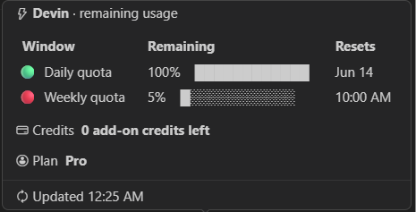

# AI Status Bar

AI Status Bar tracks AI coding-agent usage directly in the VS Code status bar.

It currently supports:

- **Codex** usage from `codex app-server`
- **Claude Code** usage from Claude's local OAuth credentials and usage endpoint
- **Devin** usage from Devin's local IDE usage cache, with optional JSON/API fallbacks

When multiple agents are available, they appear side by side in the status bar, each with its own hover popup for active usage windows, reset times, known plan details, credits, and last update time.

> Platform note: this extension has only been tested on **Windows**. macOS and Linux support is best-effort: Claude should work if credentials are in the standard location, and Codex should work if `codex app-server` is available on `PATH` or in a known extension install location.

## Screenshots


Codex, Claude Code, and Devin each get their own compact status-bar item. Hover any entry to see usage windows, reset times, credits, plan details, and the last update time.




## Why I Created This

I use multiple AI coding agents during the same development workflow. Codex, Claude Code, and Devin each have their own limits, reset windows, plan details, and credit state, but that information is easy to lose track of while coding.

This extension was created to make that usage visible without opening separate tools, running commands, or switching context. The goal is simple: keep the current state of the AI agents I rely on in the same place I already look all day, the editor status bar.

It also replaces separate status-bar experiments with one shared implementation. The agent-specific parts stay separate, but common behavior such as polling, caching, rendering, settings, warnings, and popup layout is centralized for easier maintenance.

## Features

- Detects Claude Code, Codex, and Devin automatically.
- Shows one status-bar item per detected agent.
- Displays compact primary gauges (`5h` for Codex/Claude, `day` for Devin) plus an optional weekly or cycle gauge.
- Keeps agent hover popups visually consistent across providers.
- Uses shared settings for polling, gauge width, threshold colors, locale, and presentation mode.
- Caches usage snapshots to avoid unnecessary API/process calls across windows.
- Warns when usage crosses the configured threshold.

## How To Use It

1. Install AI Status Bar from your editor's extension marketplace once published, or install a local `.vsix` build:

   ```sh
   code --install-extension ai-status-bar-1.0.0.vsix --force
   ```

2. Make sure the agents you want to monitor are signed in and usable:

   - Claude Code should have a valid `~/.claude/.credentials.json`.
   - Codex should be able to run `codex app-server`.
   - Devin should have been opened at least once so the local IDE usage cache exists.

3. Reload VS Code.

4. Look at the right side of the status bar.

   If multiple agents are detected, you should see multiple status-bar entries. Hover each entry to see its detailed popup.

5. Optional: tune settings under `AI Status Bar`.

   Useful first settings:

   ```json
   {
     "aiStatusBar.presentationMode": "agentDefault",
     "aiStatusBar.pollSeconds": 120,
     "aiStatusBar.locale": "de-DE"
   }
   ```

Use the command palette commands when needed:

- `AI Status Bar: Refresh`

## How It Works

The extension is built around a small shared core and separate agent providers.

The shared core owns the generic extension behavior:

- polling and refresh scheduling
- failure backoff
- cache reads and writes
- status-bar rendering
- hover popup rendering
- settings lookup
- warning notifications

Each provider only knows how to detect and query one agent. This keeps the implementation simple while making it straightforward to add another agent later.

### Codex

The extension starts:

```sh
codex app-server
```

Then it calls the local app-server method:

```json
{ "method": "account/rateLimits/read" }
```

Codex handles authentication and token refresh. This extension does not read Codex auth files directly.

If a configured or discovered Codex executable fails, the extension backs off before retrying. The executable path setting is machine-scoped so a repository cannot set it through workspace settings.

### Claude Code

The extension reads the existing Claude Code OAuth token from:

```text
~/.claude/.credentials.json
```

Then it calls Claude's usage endpoint with that token. The token is kept in memory only and is never written to the extension cache.

Claude usage is cached as a usage snapshot only. OAuth credentials are not cached.

### Devin

Devin usage is metered differently from Claude and Codex. In the Devin IDE, the bundled `codeium.windsurf` extension writes a usage snapshot into Devin's VS Code-style global storage:

```text
%APPDATA%\devin\User\globalStorage\state.vscdb
```

This extension reads only the cached plan/usage fields from that local store. No `DEVIN_API_KEY` is needed for the normal Devin IDE case. Because Windsurf was renamed to Devin, it also checks the old Windsurf store as a fallback:

```text
%APPDATA%\Windsurf\User\globalStorage\state.vscdb
```

The current Devin cache exposes daily and weekly quota remaining percentages, reset timestamps, plan name, and add-on credit summary. The status bar shows those as `day` and `wk`.

If you explicitly configure `aiStatusBar.devin.usageFile`, that local JSON snapshot is used first. If no local cache or JSON snapshot is available and `DEVIN_API_KEY` is set, the extension can fall back to Devin API v3 consumption endpoints:

```text
GET /v3/self
GET /v3/enterprise/consumption/cycles
GET /v3/enterprise/consumption/daily/users/{user_id}
GET /v3/enterprise/organizations/{org_id}
```

For that API fallback, set `aiStatusBar.devin.userId` to the Devin user ID whose consumption should be shown. If `/v3/self` cannot determine the organization, also set `aiStatusBar.devin.orgId`. The API fallback shows today's consumption as `day` and the current billing cycle as `cy`.

`aiStatusBar.devin.usageFile` can point at a local JSON snapshot using the same normalized shape as the extension cache, for example `fiveHour.usedPercent`, `weekly.usedPercent`, `credits.text`, and `plan`.

## Status Bar

By default:

- Codex shows remaining usage.
- Claude shows used usage.
- Devin shows used quota usage from the local IDE cache.

You can keep those native defaults or force all agents to show either used or remaining percentages with `aiStatusBar.presentationMode`.

Example status-bar shape:

```text
Codex: 🟢 5h ▰▰▱ 69% · 🟢 wk ▰▰▱ 51%   Claude: 🟢 5h ▰▰▰ 100%   Devin: 🟢 day ▰▰▰ 100%
```

## Settings

All settings are under `aiStatusBar`.

| Setting | Default | Description |
| --- | --- | --- |
| `pollSeconds` | `120` | How often to refresh usage data. |
| `barCells` | `3` | Number of segments in the compact status-bar gauge. |
| `showWeekly` | `true` | Show the secondary weekly or billing-cycle usage window. The primary 5-hour or daily window is otherwise always shown. |
| `replacePrimaryWithWeeklyOnLimit` | `true` | When the secondary weekly or billing-cycle limit is reached, show that exhausted budget in the primary status-bar slot instead of the 5-hour or daily budget. |
| `presentationMode` | `agentDefault` | `agentDefault`, `used`, or `remaining`. |
| `cautionAt` | `70` | Used percentage where the status indicator turns yellow. |
| `warnAt` | `90` | Used percentage where the status indicator turns red and warning notifications can appear. |
| `locale` | `""` | BCP-47 locale for reset times, for example `de-DE`. Empty uses the system locale. |
| `claude.enabled` | `true` | Enable or disable Claude Code detection and display. |
| `codex.enabled` | `true` | Enable or disable Codex detection and display. |
| `codex.command` | `codex` | Codex executable path or command. This is machine-scoped for safety. |
| `devin.enabled` | `true` | Enable or disable Devin detection and display. |
| `devin.apiKeyEnv` | `DEVIN_API_KEY` | Optional environment variable containing a Devin `cog_` API key for the API fallback. |
| `devin.orgId` | `""` | Devin organization ID for the API fallback. Usually discovered from `/v3/self` when the token allows it. |
| `devin.userId` | `""` | Devin user ID to query for consumption in the API fallback. |
| `devin.cycleAcuLimit` | `0` | Optional quota/ACU limit when the API does not return an organization cycle limit. |
| `devin.usageFile` | `""` | Optional local JSON usage snapshot override. |

Example:

```json
{
  "aiStatusBar.presentationMode": "remaining",
  "aiStatusBar.locale": "de-DE",
  "aiStatusBar.warnAt": 90,
  "aiStatusBar.claude.enabled": true,
  "aiStatusBar.codex.enabled": true,
  "aiStatusBar.devin.enabled": true,
  "aiStatusBar.devin.userId": "user_...",
  "aiStatusBar.codex.command": "C:\\Users\\you\\AppData\\Roaming\\npm\\node_modules\\@openai\\codex\\node_modules\\@openai\\codex-win32-x64\\vendor\\x86_64-pc-windows-msvc\\codex\\codex.exe"
}
```

## macOS and Linux

This extension is **not yet tested** on macOS or Linux.

Best-effort support is included:

- Claude uses `~/.claude/.credentials.json`, which should be platform-neutral.
- Codex first checks known bundled binary locations for the current platform.
- If no bundled binary is found, Codex falls back to `codex` on `PATH`.

For non-Windows environments, first verify this works in a terminal:

```sh
codex app-server
```

If Codex is installed somewhere custom, set `aiStatusBar.codex.command` to the full executable path in user or machine settings.

## Privacy and Security

This extension is intentionally read-only from the agents' point of view.

What it reads:

- Claude's local credentials file, only to get the existing OAuth token.
- Codex usage data through `codex app-server`.
- Devin's local IDE usage cache, or an optional local JSON file when configured.
- Devin usage through the documented Devin API only when no local cache is available and `DEVIN_API_KEY` is set.
- Its own cache files under VS Code extension storage.

What it writes:

- Usage snapshot cache files under VS Code extension storage.

What it does not do:

- It does not write, replace, or refresh Claude credentials.
- It does not read Codex auth files directly.
- It does not read Devin browser/session auth secrets directly.
- It does not transmit tokens to any third-party service.
- It does not trust workspace settings for the Codex executable path.

Security choices:

- Claude OAuth tokens are kept in memory only.
- Usage cache files contain usage snapshots, not credentials.
- `aiStatusBar.codex.command` is machine-scoped so a workspace cannot override it with a repository-local executable.
- Devin API settings are machine-scoped, and the API key is read from an environment variable rather than stored in settings.
- `.cmd` and `.bat` Codex shims are rejected on Windows to avoid future shell-injection footguns.
- Tooltip content from APIs and process output is escaped before rendering.
- Codex child processes are cleaned up on timeout, failure, and extension disposal.

## Build

```sh
npm install
npm run compile
npx @vscode/vsce package
```

The generated `.vsix` can be installed with:

```sh
code --install-extension ai-status-bar-1.0.0.vsix --force
```

See `PRIVACY.md` for local data notes and `CHANGELOG.md` for release history.

## Limitations

- The extension is unofficial.
- Claude usage uses an internal/undocumented endpoint and may break if Claude changes it.
- Codex support depends on the local `codex app-server` protocol.
- Devin API support requires a `cog_` API key with consumption permissions. Self-serve quota details may still require Devin's Settings > Plans page if not exposed to your token.
- Windows is the only tested platform at this time.
