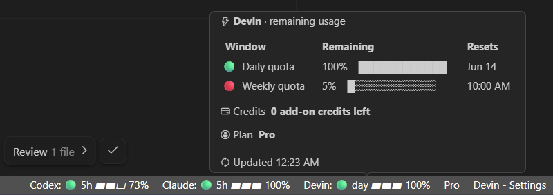
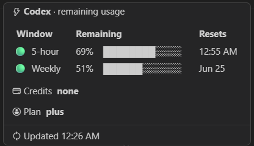
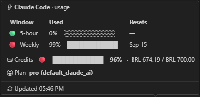

# AI Status Bar

Track **Codex** and **Claude Code** usage without leaving VS Code. AI Status Bar
keeps your active usage windows, reset times, plan details, credits, and rate-limit
state in the status bar and an always-visible sidebar panel.

**Supported agents:** Codex and Claude Code · **Platform:** tested on Windows;
macOS and Linux are best-effort.



One compact entry per available agent—visible where you already work.

## What you get

- **Usage at a glance.** See the primary `5h` window and an optional weekly or
  billing-cycle window, with clear status indicators.
- **Details when you need them.** Hover an entry for reset times, plan details
  (including Claude subscription and rate-limit tier when available), credits,
  rate-limit information, and the last update time.
- **A sidebar view.** The **AI Usage** activity-bar panel mirrors the hover
  details with proportional usage bars and a refresh button.
- **Useful defaults, flexible display.** Keep each agent's native used/remaining
  presentation, or choose a single style for every agent.
- **Private by design.** The extension accesses only the usage data it needs and
  never persists Claude OAuth tokens.

## See it in action

Hover either status-bar entry for the active usage windows and account details.





## Install in VS Code

AI Status Bar is distributed as a `.vsix` release package.

1. Download the latest `ai-status-bar-<version>.vsix` from the
   [GitHub Releases page](https://github.com/joaomariok/ai-status-bar/releases).
2. In VS Code, open the Command Palette and choose **Extensions: Install from
   VSIX...**.
3. Select the downloaded `.vsix` file, then run **Developer: Reload Window**.

### Install from the command line

If the VS Code `code` command is available on your `PATH`, install the same
downloaded file with:

```sh
code --install-extension ai-status-bar-<version>.vsix --force
```

## First run

Before the extension can show an agent, that agent must already be signed in and
available on your machine:

- **Claude Code:** sign in with Claude Code so its standard
  `~/.claude/.credentials.json` file exists and contains valid credentials.
- **Codex:** install and sign in to Codex. AI Status Bar checks known installation
  locations and `PATH`; for a custom installation, set `aiStatusBar.codex.command`
  to the full executable path. Codex stays hidden until a safe executable is found.
  On Windows, configure `codex.exe` directly; `.cmd` and `.bat` shims are rejected.

Reload VS Code after installation. Look at the right side of the status bar; if
both agents are detected, each gets its own entry. Open the **AI Usage** view in
the activity bar when you want the same information to stay visible.

> **Windows-tested:** macOS and Linux support is best-effort. Claude should work
> when credentials are in the standard location; Codex should work when
> `codex app-server` is available on `PATH` or in a known extension install
> location. See [macOS and Linux](#macos-and-linux) for details.

## Customize

The default display shows **remaining** Codex usage and **used** Claude usage. To
use one presentation across both agents, choose `aiStatusBar.presentationMode`:

- `agentDefault` keeps each agent's native display style.
- `used` shows used percentages for every agent.
- `remaining` shows remaining percentages for every agent.

You can also use `aiStatusBar.statusBarStyle: "compact"` to show percentages
without gauges, and `aiStatusBar.agentNameStyle: "icon"` for icon-only entries.
Open Settings and search for **AI Status Bar**, or edit `settings.json` directly.

For example:

```json
{
  "aiStatusBar.presentationMode": "remaining",
  "aiStatusBar.statusBarStyle": "compact",
  "aiStatusBar.locale": "de-DE",
  "aiStatusBar.warnAt": 90,
  "aiStatusBar.claude.enabled": true,
  "aiStatusBar.codex.enabled": true,
  "aiStatusBar.codex.command": "C:\\Users\\you\\AppData\\Roaming\\npm\\node_modules\\@openai\\codex\\node_modules\\@openai\\codex-win32-x64\\vendor\\x86_64-pc-windows-msvc\\codex\\codex.exe"
}
```

Use **AI Status Bar: Refresh** from the Command Palette whenever you want to
refresh usage immediately.

### Settings reference

All settings are under `aiStatusBar`.

| Setting | Default | Description |
| --- | --- | --- |
| `pollSeconds` | `120` | How often to refresh usage data. |
| `barCells` | `3` | Number of segments in the status-bar gauge (`statusBarStyle: full` only). |
| `statusBarStyle` | `full` | `full` (gauge + percentage) or `compact` (percentage only, no gauge). Does not affect the hover tooltip. |
| `agentNameStyle` | `both` | `text` (name only), `icon` (brand icon only), or `both` (icon + name) at the start of each status-bar item. |
| `showWeekly` | `true` | Show the secondary weekly or billing-cycle usage window. The primary 5-hour or daily window is otherwise always shown. |
| `replacePrimaryWithWeeklyOnLimit` | `true` | When the secondary weekly or billing-cycle limit is reached, show that exhausted budget in the primary status-bar slot instead of the 5-hour or daily budget. |
| `presentationMode` | `agentDefault` | `agentDefault`, `used`, or `remaining`. |
| `cautionAt` | `70` | Used percentage where the status indicator turns yellow. |
| `warnAt` | `90` | Used percentage where the status indicator turns red and warning notifications can appear. |
| `locale` | `""` | BCP-47 locale for reset times, for example `de-DE`. Empty uses the system locale. |
| `resetTimeFormat` | `absolute` | `absolute` (clock time or date), `relative` (countdown, for example `in 2h 15m`), or `both`. `locale` only affects the absolute part. |
| `claude.enabled` | `true` | Enable or disable Claude Code detection and display. |
| `codex.enabled` | `true` | Enable or disable Codex detection and display. |
| `codex.command` | `codex` | Codex executable path or command. It must resolve to an executable; Windows `.cmd`/`.bat` shims are rejected. This is machine-scoped for safety. |

## Privacy and security

AI Status Bar is intentionally read-only from the agents' point of view.

- **Leaves your device:** Claude usage requests go to Anthropic's OAuth usage
  endpoint using Claude Code's existing OAuth token.
- **Stays local:** Codex usage is requested from a local `codex app-server`
  process; normalized usage snapshots are cached in VS Code extension storage.
- **Never persists:** Claude OAuth tokens and raw credential-file contents are not
  written to the extension cache. A normalized Claude plan label may be cached with
  the usage snapshot.

See [PRIVACY.md](PRIVACY.md) for the complete technical data-flow, security-boundary,
and scope details.

## macOS and Linux

This extension is not yet tested on macOS or Linux. Best-effort support is included:

- Claude uses `~/.claude/.credentials.json`, which should be platform-neutral.
- Codex first checks known bundled binary locations for the current platform.
- If no bundled binary is found, Codex falls back to `codex` on `PATH`.

For non-Windows environments, first verify this works in a terminal:

```sh
codex app-server
```

If Codex is installed somewhere custom, set `aiStatusBar.codex.command` to the full
executable path in user or machine settings.

## Build and contribute

To build a local `.vsix` package:

```sh
npm install
npm run pack
```

Install the generated package with:

```sh
code --install-extension ai-status-bar-<version>.vsix --force
```

For local development, the watch loop, Extension Development Host, and test workflow,
see [docs/development.md](docs/development.md).

See [CHANGELOG.md](CHANGELOG.md) for release history.

## Limitations

- The extension is unofficial.
- Claude usage uses an internal/undocumented endpoint and may break if Claude
  changes it.
- Codex support depends on the local `codex app-server` protocol.
- Windows is the only tested platform at this time.
- The Claude and Codex status-bar icons are unmodified monochrome marks from a
  third-party icon pack, used nominatively to identify the products whose usage is
  shown; see [docs/icons.md](docs/icons.md) for sources.
