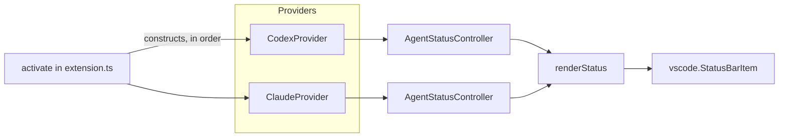

# Architecture

The extension has one job: poll a handful of `AgentProvider` implementations on a
timer and render their usage into status-bar items. All shared behavior —
polling, caching, backoff, rendering, settings — lives in `src/shared/`; each
agent's data-fetching lives in its own file under `src/agents/`.

## Activation and ordering

[`src/extension.ts`](../src/extension.ts) runs on `onStartupFinished` and constructs
providers in a **fixed array order: Codex, Claude**. This order matters
twice:

- Status-bar priority is `100 - index`, so **array order determines left-to-right
  placement** in the status bar.
- Each controller's first poll is staggered by `3s + index * 1.5s`, so providers
  don't all hit the network/spawn a process in the same tick.

Adding a fourth provider means appending to this array; there is no separate
registry.

## Controller lifecycle

[`AgentStatusController`](../src/shared/statusController.ts) owns one
`vscode.StatusBarItem` and drives one provider through a repeating
`setTimeout` chain (not `setInterval` — each poll schedules the next one from
its own completion, so a slow request can't overlap the next tick; an
`inFlight` guard enforces this too).

Each poll:

1. `provider.detect()` — if unavailable, hide the item and stop (still
   reschedules).
2. Unless forced (`refresh()` bypasses this), read the on-disk cache
   (`context.globalStorageUri/<provider.id>-usage-cache.json`). If it's younger
   than `pollSeconds`, render from the cache and reschedule for the remaining
   time — no network/process call happens.
3. Otherwise call `provider.fetchUsage()`, write the result to cache
   (temp-file-then-rename, version-gated by `CACHE_VERSION` in
   [`cache.ts`](../src/shared/cache.ts) — bumping that constant invalidates
   every cached snapshot on next load), and render.
4. On any thrown error, show a warning glyph with a short note and back off
   (see below) instead of retrying at the normal interval.

`refresh()` (bound to the `AI Status Bar: Refresh` command) calls `poll(true)`,
which skips the cache check but does not reset the backoff state.

## Failure handling and backoff

On error, the next poll delay is:

- The error's `retryAfterMs` (if a provider attached one — see Claude's
  `Retry-After` handling), clamped to `[5s, 30min]`, **or**
- The current backoff doubled, starting from `pollSeconds`, capped at 30
  minutes.

A successful poll resets backoff back to `pollSeconds`. HTTP status is read
from `error.status`/`error.statusCode` or parsed out of an `HTTP NNN` message,
purely to produce a human-readable note (`rate limited (HTTP 429)`, `token
rejected...`).

## The `AgentProvider` contract

Defined in [`src/shared/types.ts`](../src/shared/types.ts). Every provider
implements `isEnabled()`, `detect()`, `fetchUsage()`, and declares
`defaultPresentationMode` (`used` or `remaining`) plus optional
`windowLabels`.

**`AgentUsage.fiveHour` / `.weekly` are positional slots, not literal time
windows.** They're rendered as "primary" and "secondary" gauges regardless of
what they actually represent. Label resolution order is
`usage.windowLabels ?? provider.windowLabels ?? hardcoded default`
([renderer.ts](../src/shared/renderer.ts) L30) — a per-fetch `windowLabels` on
the returned `AgentUsage` would override a provider's static `windowLabels`,
but neither current provider (Codex, Claude) uses this override; both rely on
the hardcoded `5h`/`wk` default.

`replacePrimaryWithWeeklyOnLimit` (a global setting) swaps which slot renders
in the primary status-bar position when the secondary window's `usedPercent`
reaches 100 — used so an exhausted weekly/cycle budget isn't hidden behind a
still-healthy 5-hour/daily gauge.

### Adding or changing a setting

A new `aiStatusBar.*` setting needs **three** edits, not one:

1. `contributes.configuration` in [`package.json`](../package.json) (the
   schema VS Code validates and shows in Settings UI).
2. A read in [`src/shared/settings.ts`](../src/shared/settings.ts) (or inline
   `getBool`/`getString`/`getNumber` in the relevant provider).
3. The settings table in [`README.md`](../README.md#settings).

## Rendering

[`renderer.ts`](../src/shared/renderer.ts) is pure: given a provider, settings,
and the last known `AgentUsage`, it produces status-bar text and a
`MarkdownString` tooltip. It has no knowledge of polling, caching, or network
state beyond the `note`/`updatedAt` fields the controller passes in. All
dynamic tooltip text (credits text, plan name, error notes) is passed through
`escapeMarkdown()` in [`format.ts`](../src/shared/format.ts) before rendering
— required because provider payloads can contain arbitrary strings.

Status-bar window text (e.g. `5h ▰▱▱ 34%`) is built by `statusPart()` in
[`format.ts`](../src/shared/format.ts), the one vscode-free piece of
rendering, so it's directly unit-testable. The `statusBarStyle` setting
switches its output between the `full` gauge form and a `compact`
`label: pct` form; the tooltip is unaffected either way.
